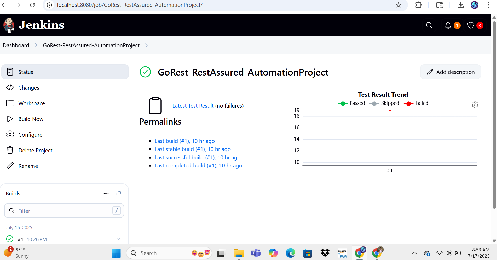

# 🧪 GoRestRestAssured

This project showcases REST API test automation for the [GoRest public API](https://gorest.co.in/) using a scalable and modular framework built with **REST Assured**, **TestNG**, **Java**, and **Maven**.

> ✅ Users, Posts, Comments modules  
> ✅ Full CRUD operations  
> ✅ Data-driven testing with CSV  
> ✅ Schema validation, status code checks, performance assertions  
> ✅ Parallel + sequential test execution strategy  
> ✅ Clean structure for both positive and negative test scenarios  

---

## 🚀 Tech Stack

- Java 17  
- REST Assured  
- TestNG  
- Maven  
- Jackson (JSON mapping)  
- OpenCSV (CSV parsing)  
- SLF4J + Logback (logging)  

---

## 📁 Project Structure

src/
├── main/java/com/gorest/
│ ├── base/ # BaseTest setup
│ ├── endpoints/ # Centralized API endpoint constants
│ ├── models/ # POJOs for Users, Posts, Comments
│ ├── utils/ # Assertions, schema validator, logger, CSV reader, TestDataManager
│ └── data/ # CSV DataProviders for test inputs

├── test/java/com/gorest/tests/
│ ├── users/
│ │ ├── positive/
│ │ └── negative/
│ ├── posts/
│ │ ├── positive/
│ │ └── negative/
│ ├── comments/
│ │ ├── positive/
│ │ └── negative/
│ └── delete/ # Delete by userId, postId, commentId

└── resources/
├── data/ # CSV test data files
└── schemas/ # JSON schema files for validation

markdown
Copy

---

## ✅ Test Coverage

### Users Module
- ✅ `POST /users` – Create user  
- ✅ `GET /users/{id}` – Get user by ID  
- ✅ `PUT /users/{id}` – Update user  
- ✅ `PATCH /users/{id}` – Partial update  
- ✅ `DELETE /users/{id}` – Delete user  

### Posts Module
- ✅ `POST /posts` – Create post  
- ✅ `GET /posts/{id}` – Get post by ID  
- ✅ `PUT /posts/{id}` – Update post  
- ✅ `PATCH /posts/{id}` – Partial update  
- ✅ `DELETE /posts/{id}` – Delete post  

### Comments Module
- ✅ `POST /comments` – Create comment  
- ✅ `GET /comments/{id}` – Get comment by ID  
- ✅ `PUT /comments/{id}` – Update comment  
- ✅ `PATCH /comments/{id}` – Partial update  
- ✅ `DELETE /comments/{id}` – Delete comment  

---

## 🧬 Data-Driven Testing

- POST, PUT, PATCH tests are data-driven  
- Test data is sourced from CSV files in `resources/data/`  
- Uses OpenCSV to load CSV data into POJOs  
- Supports conditional execution using `testType` and null checks  

---

## ✅ Assertions & Validations

- ✅ HTTP status code validations (200, 201, 204, 422, 404)  
- ✅ Field-level assertions  
- ✅ JSON schema validation  
- ✅ Regex validations (e.g., email format)  
- ✅ Performance: response time < 3000ms  

---

## 🔀 Execution Strategy

- ✅ Parallel execution for independent tests (e.g., GetAllUsers, GetAllPosts)  
- ✅ Sequential execution using `dependsOnMethods` for chained tests  
- ✅ Thread-safe data handling with `ThreadLocal` in `TestDataManager`  

---

## 🧪 How to Run Tests

### Requirements:
- Java 17+  
- Maven

### Run All Tests:
```bash
mvn clean test
Run Specific Suite:
bash
Copy
mvn test -DsuiteXmlFile=testng.xml
🔁 CI/CD: Jenkins Integration
Jenkins is configured to run testng.xml using Maven

Build command: mvn clean test -DsuiteXmlFile=testng.xml

Results published using JUnit + HTML reports (optional)

In local setup:
Jenkins is manually triggered after each push

GitHub webhook integration is possible using ngrok or a cloud Jenkins setup

✅ Build Success Example:


📸 Sample Test Output
Status Code: ✅ 201 Created

Response Time: ✅ < 2000ms

Schema Validation: ✅ Passed

Logs: Available in SLF4J console output

📌 Notes
GoRest is a public API, so data conflicts may occur

Unique data is generated using random values

All test-created records are cleaned up via DELETE endpoints

🧾 Version Control
GitHub Repo: GoRestRestAssured


🙋‍♀️ Author
Saranya Seenivasan
💻 SDET | UI | API | Automation | Testing Portfolio
🔗 LinkedIn: www.linkedin.com/in/saranya-seenivasan


